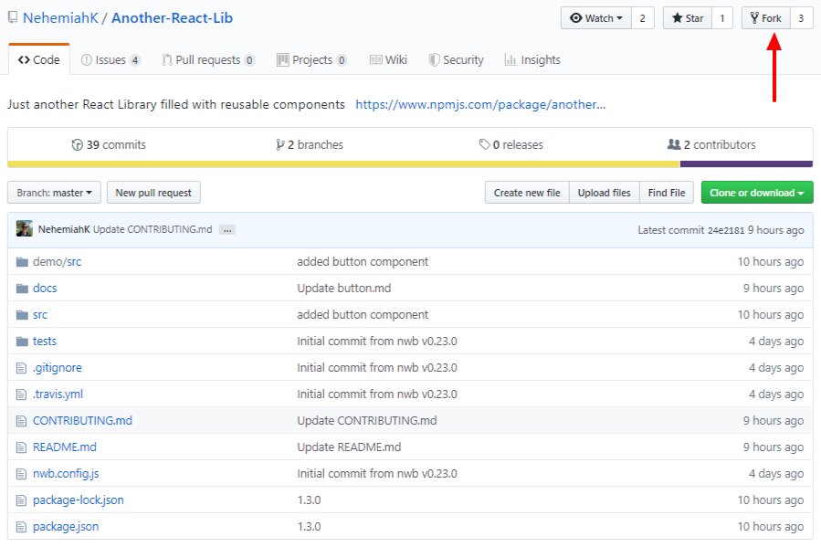
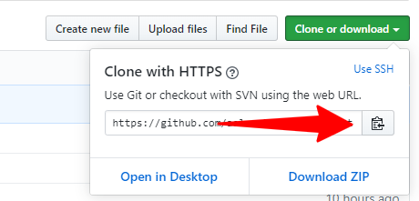
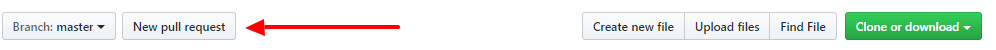

## Prerequisites

[Node.js](http://nodejs.org/) >= 6 must be installed.

[Git](https://www.git-scm.com/) must be installed.

## Installation

- Running `npm install` in the component's root directory will install everything you need for development.

## Demo Development Server

- `npm start` will run a development server with the component's demo app at [http://localhost:3000](http://localhost:3000) with hot module reloading.

## How to contribute

Step 0 I to check the issues section, if you want to work on something that doesn't have an issue for it yet, please make one so everyone knows you're working on it. If you see an issue that interests you, just comment that you want to take that issue and it will be assigned to you.

In order to contribute to this project, you can follow below steps :

**Fork the repository**

You can fork the repository by clicking on the button shown in the below screenshot.

Once the process is done, your browser will redirect you to a screen similar to the repository image above, except that at the top you will see your **username** before the repository name, and in the URL it will also say your **username** before the repository name.

**Clone the Repository**

To make your own local copy of the repository, you'll use the `git clone` command along with the URL that points to your fork of the repository which you can get by using the green “Clone or download” where there is a button which copies the URL in your clipboard.

The URL will look like this:

`https://github.com/your-username/Another-React-Lib.git`

and the complete command will be :

`git clone https://github.com/your-username/Another-React-Lib.git`

Make sure your replace `your-username` with your github username.

**Make changes in the local Repository**

Once the repository is cloned, you must point to the project root directory from your terminal like this :

`cd Another-React-Lib`

And then create a new branch where your changes will be made in.

Below 2 commands you have the same result which is creating and checking out to a new branch named **feature-branch** :

`git branch feature-branch && git checkout feature-branch`

`git checkout -b feature-branch`

**Commit & Push changes to remote Repository**

After making the necessary changes, you must stage the files using the `git add` command like this :

`git add -A`

The files are now staged, you can save the changes in the git history using the `git commit` command :

`git commit -m "Commit message"`

Now you are ready to push these changes to the remote repository, to do so all you need to do is to run the following command :

`git push --set-upstream origin feature-branch`

**Create a pull request**

You're now ready to make your **Pull Request**.

Go to your forked repository, and press the “New pull request” button.

You will be redirected to another page where you will choose the master branch of the original repository (left side) and the feature-branch of your forked repository (right side).

Put a significant title, a comment and then press the "Create pull request" button.

That's it, you've made a pull request.

## Quality Guidelines for contributing

Making an example of how to use the component and which props the component will use would be awesome.

## Running Tests

- `npm test` will run the tests once.

- `npm run test:coverage` will run the tests and produce a coverage report in `coverage/`.

- `npm run test:watch` will run the tests on every change.
